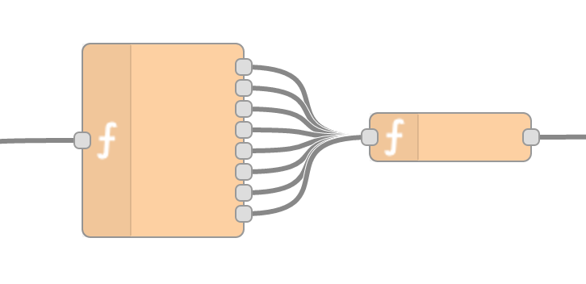
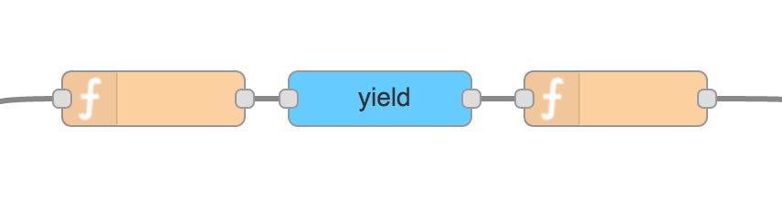

# node-red-contrib-yield

This simple node sends messages passed from `msg.payload` separately down the flow. With this node, you can send multiple messages to the next node without having multiple outputs. The number of outputs is also dynamic.

You can turn this



into this:



Just pass in an array of messages as payload like shown in the flowing example:

```js
msg.payload = [
  {
    topic: 'topic-1',
    payload: 'payload-1',
  },
  {
    topic: 'topic-2',
    payload: 'payload-2',
  },
  ...
]
```
